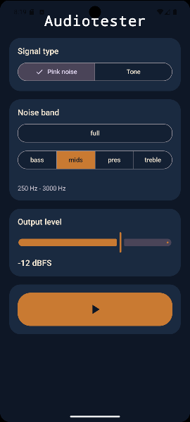
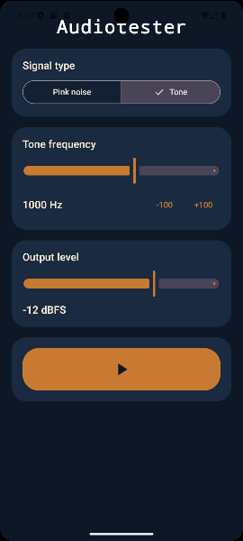

# Audiotester

Audiotester is a simple Android signal generator for testing audio devices.
It is designed to send audio over normal Android media output paths such as Bluetooth speakers, headphones, DACs, or other paired playback devices.

I am using the app with a cheap bluetooth receiver that is connected to the device under repair.

The app provides:

- Pink noise playback
- Five selectable noise bands: full, bass, mids, presence, treble
- Sine wave test tone generation with variable frequency

The pink noise generator with four bands:

Sine wave generator:

## Requirements

- Android Studio
- Android SDK installed through Android Studio
- JDK 17
- Android device running Android 8.0 (API 26) or newer, or an emulator for basic UI checks

## Project structure

- `app/src/main/java/com/audiotester/`
  Android app source code
- `app/src/main/java/com/audiotester/AudioEngine.kt`
  Real-time audio generation for pink noise and sine tones
- `app/src/main/java/com/audiotester/MainActivity.kt`
  Jetpack Compose UI

## Build in Android Studio

1. Open Android Studio.
2. Open the project folder:
   `/mnt/c/proj/pinknoise_app`
3. Let Gradle sync the project.
4. If Android Studio asks to install missing SDK components, allow it.
5. Select a device and run the `app` configuration.

## Install on a physical Android device

1. Enable Developer Options on the phone.
2. Enable `USB debugging`.
3. Connect the device over USB.
4. Accept the debugging prompt on the phone.
5. In Android Studio, select the device and press Run.

Android Studio will build and install the debug app automatically.

## Build an APK

To build a debug APK in Android Studio:

1. Open `Build > Build Bundle(s) / APK(s) > Build APK(s)`.
2. Wait for the build to finish.
3. Open the generated APK from the build notification.

## Usage

1. Pair and connect your Bluetooth audio device in Android settings.
2. Start Audiotester.
3. Choose either `Pink noise` or `Tone`.
4. For pink noise, select `bass`, `mids`, or `treble`.
5. For tone mode, adjust the frequency slider.
6. Set output level conservatively before starting playback.
7. Press the play button to start output.

## Notes

- Bluetooth pairing and routing are handled by Android, not by the app.
- The app uses standard media playback routing via `AudioTrack`.
- For reliable external audio tests, use a physical device rather than an emulator.

## License

This project is licensed under the MIT License. See `LICENSE`.
